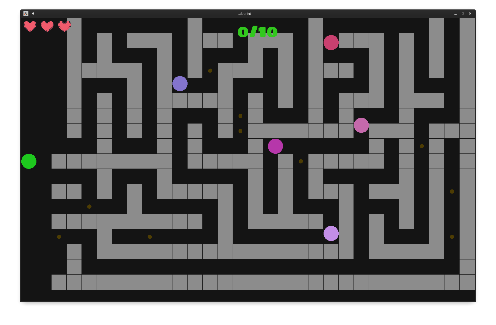

# PacLaberint
Aquest joc està dividit en dues parts: menú i joc. Inicialment es va fer el joc fent ús de SFML. Després vaig incorporar un menú amb Qt, amb l'avantatge que en ambdós projectes s'empra C++. És per això que va ser prou fàcil juntar-los en un sol, idò només va fer falta afegir els arxius del joc i SFML al projecte Qt.<br><br>
Dividirem aquest README en tres parts: manual d'ús, instal·lació i estructura del programa.

# Manual d'ús

El menú es poden fer les accions següents:
<ul>
<li>Seleccionar una configuració guardada</li>
<li>Inserir un nom a una coanfiguració (al quadre de texte)</li>

<li>Configurar la partida:<ul>
<li>Nombre de caselles horitzontals (les verticals venen donades per la resolució)</li>
<li>Nombre de monedes (es guanya si s'agafen totes, i cada 3 es guanya una vida més)</li>
<li>Factor velocitat: podeu canviar la velocitat en funció de l'ordinador i la dificultat</li>
<li>Pantalla completa (marcar SÍ o NO)</li>
<li>Indicar la resolució (si és pantalla competa és recomanable posar la resolució de la pantalla</li>
<li>Nombre d'enemics (recordau que es mouen més aviat)</li>
<li>Nombre de vides</li>
</ul></li>

<li>Guardar la configuració actual (ho farà en un arxiu _.txt_ amb el nom que hageu posat</li>
<li>Esborrar la configuració actual (l'arxiu que la conté)</li>
<li>Començar la partida amb les condicions imposades</li>
</ul><br>
Llavors, un pic en la pantalla del joc:

el seu objectiu és agafar totes les monedes (cercles grocs) i que els enemics no us deixin sense vides. Cada 3 monedes teniu una vida més. A la primera columna del laberint estau segurs, idò els enemics no hi poden passar. Per controlar-ho teniu aquestes tecles:
<ul>
<li><b>Fletxes</b> per a moure el jugador (IMPORTANT: manteniu-les pitjades fins que giri, idò esperarà a què estigui en una sola casella)</li>
<li><b>P</b>: pausa/conitnuar</li>
<li><b>ESPAI</b>: mantenir pitjat fins que s'aturi el jugador</li>
<li><b>INTRO</b>: nova partida amb la mateixa configuració.</li>
<li><b>ESC</b> o <b>ALT+F4</b> per sortir del joc i tornar al menú</li>
</ul>

# Instal·lació
Per ara només està disponible per al Linux. Anau a la pàgina de <a href="https://github.com/GerrySoft/PacLaberint/releases">releases</a> i hi trobrareu l'apartat <b>... Linux - AppImage</b>. Està compactat en un zip per incloure també les imatges i les fonts. Un pic descarregat, és recomanable seguir les passes següents:
<ul>
<li>Crear una carpeta i extreure els arxius del zip a aquella carpeta.</li>
<li>L'arxiu principal és *.AppImage. Si voleu que a aquella carpeta es guardin les configuracions i tots els arxius de l'aplicació, cal fer que sempre s'executi des d'aquella carpeta. Per això podeu:<ul>
<li>Crear un arxiu executable (`chmod +x arxiu`) amb el coningut següent:</li></ul></li></ul>

```bash
#!/usr/bin/bash
cd "ruta de la carpeta" # anam a la carpeta
./*.AppImage # executam l'arxiu (des de la carpeta)
```
<ul>
<li>També és recomanable afegir-ho al menú principal d'aplicacions, que es fa en funció del vostre entorn d'escriptori (GNOME, KDE, XFCE, ...)</li>
</ul>

# Estructura del joc
Com hem vist, està dividit en dues parts: menú i joc.
## Menú
El menú del joc és una aplicació bastant senzilla creada en Qt (de fet, la primera que faig en Qt). Té un formulari molt senzill per triar les configuracions del joc, que només cal iniciar-lo incloent-hi les capçaleres corresponents i cridant al mètode _joc()_, amb les configuracions com argument. A més a més, les configuracions es poden guardar i tornar a carregar amb un nom i també la darrera partida. Va ser molt fàcil incorporar el joc a aquesta aplicació, idò tots dos estan fets en C++.
## Joc
En primer lloc hi tenim l'arxiu _joc.cpp_, que com podem veure està completament comentat. Això és pel fet que al començament feia falta un arxiu _.cpp_ amb el mètode de _main()_ al ser un projecte separat. Al juntar-ho, es va comentar i es va afegir a _laberint.h_ amb el mètode _joc()_. Aquest arxiu sempre ha estat pensat per a fer el sistema de creació de laberints (_bactracking_), que era la primera idea de totes, fer un laberint amb _n x m_ caselles, i llavors es va fer tot el joc. De fet, es pot veure perfectament, ja que hi trobam diversos macros enmig de l'arxiu, que és l'afegit del motor del joc.<br>

Llavors hi trobam _jugador.h_, amb tot el sistema per a moure un jugador, tenint en compte que pot ocupar part d'una casella, i per tant per als girs calia un sistema per a comprovar si estava més o manco encaixat en una, per evitar problemes de travessar les parets.<br>

Fialment, _enemic.h_ és el mateix però per als enemics, fent la trampa que es comporta com un jugador (de fet té el mateix però canviant el color (que no sigui d'un to verd per a no confondre-ho amb el jugador) i el sistema per a què es mogui tot sol. Per tant, és una classe heredada. Llavors hi trobam els arxius per a la font (.ttf) i les imatges (*.png).
